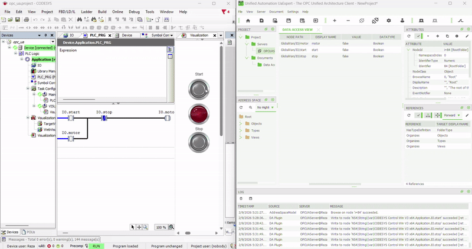

# OPC-UA
In this project connection of CodeSys program to UaExpert using a OPC UA protocols is shown.

Features

Start - Stop - Motor

OPC - UA 

CodeSys

Application

Establishing the CodeSys and OPC.
I set up a new project in CODESYS using the standard project template and selected a CODESYS Control Win V3 device. Within the application, I created a PLC_PRG program using the Ladder Diagram (LD) language.

       IO.start                        IO.stop
---------[  NO  ]---------------------[  NC  ]--------------------( ) IO.motor
|                             |
+-----[  NO  IO.motor ]-------+

## 🎬 System Demo

